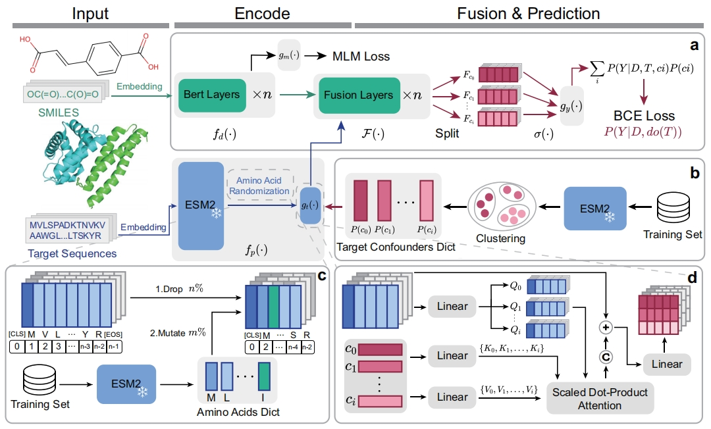

# TAPB: An Interventional Debiasing Framework for Alleviating Target Prior Bias in Drug-Target Interaction Prediction

This repository contains the PyTorch implementation of **TAPB**, which aims to alleviate target prior bias in DTI prediction.

## Framework



## System Requirements

The source code was developed in Python 3.9 using PyTorch 2.2.1. The required Python dependencies are given below. TAPB is supported for any standard computer and operating system (Windows/macOS/Linux) with enough RAM to run. There are no additional non-standard hardware requirements.

```
torch=2.2.1
numpy=1.23.0
scikit-learn=1.2.1
pandas=2.2.3
prettytable>=2.2.1
rdkit~=2024.3.3
transformers=4.38.2
tqdm~=4.66.2
pandas~=2.2.3
matplotlib=3.5.0
omegaconf=2.3.0
```

## Datasets

The `datasets` folder contains all experimental data used in TAPB: [BindingDB](https://github.com/peizhenbai/DrugBAN), [BioSNAP](https://github.com/peizhenbai/DrugBAN)

## Run TAPB on Our Data to Reproduce Results

To train TAPB, we provide the basic configurations for hyperparameters in `model_config.yaml` and `train_config.yaml`.


For that we use Molformer's tokenizer to seg SMILES and ESM-2 to extract target features, please download the weights and related files and put them into `./models/drug/molformer` and `./protein/esm2_model`, separately.

Molformer can be downloaded from [Molformer Hugging Face](https://huggingface.co/ibm-research/MoLFormer-XL-both-10pct/tree/main). ESM-2 can be downloaded from [ESM-2 Hugging Face](https://huggingface.co/facebook/esm2_t33_650M_UR50D). 

To accelerate the training process and reduce GPU memory usage, we pre-extract and save the target features for each dataset using ESM-2. In `./models/protein/generate_pr_feature.py`, you can specify your dataset of interest.

```
$ python generate_pr_feature.py
```

For the in-domain experiments, you can directly run the following command for interventional training. `${dataset}` could either be `bindingdb`, `biosnap`, `davis`, `human`.

```
$ python main.py --data ${dataset} --split "random"
```

For the cross-domain experiments, you can directly run the following command for interventional training. `${dataset}` could be either `bindingdb`, `biosnap`.

```
$ python main.py --data ${dataset} --split "cluster"
```
